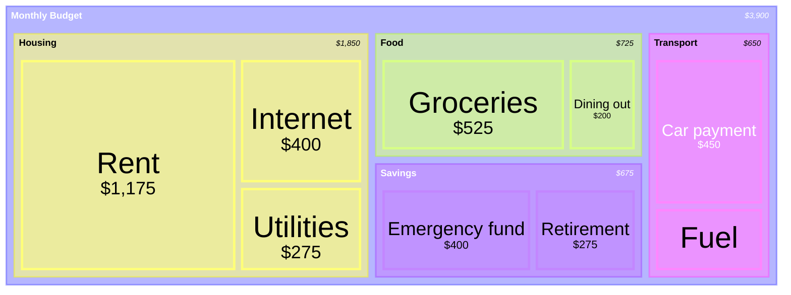

```mermaid


---
config:
  treemap:
    valueFormat: '$0,0'
---
treemap-beta
"Monthly Budget"
    "Housing"
        "Rent": 1175
        "Utilities": 275
        "Internet": 400
    "Food"
        "Groceries": 525
        "Dining out": 200
    "Transport"
        "Car payment": 450
        "Fuel": 200
    "Savings"
        "Emergency fund": 400
        "Retirement": 275
```